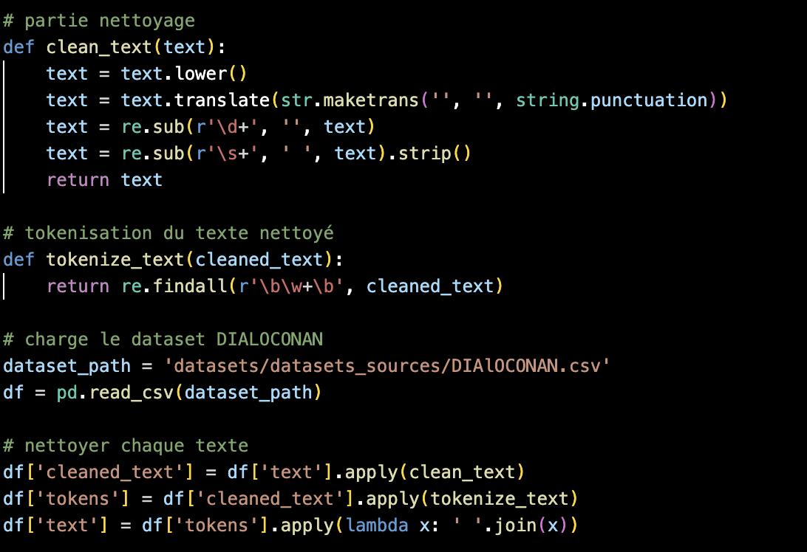
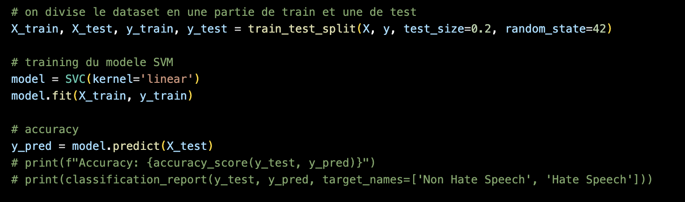
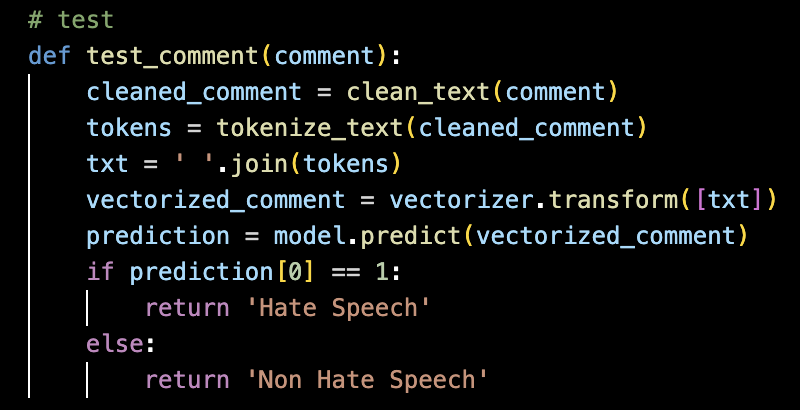
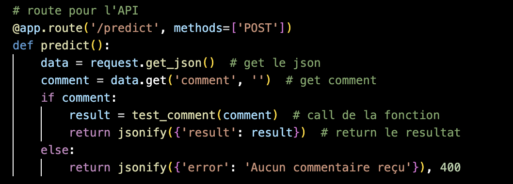

# README - Partie IA

## Fichier Principal

Le fichier Python qui nous intéresse pour la partie IA est `test.py`.

## Description

Ce script a pour but de nettoyer un dataset de commentaires et d'entraîner un modèle de classification capable de détecter si un commentaire est considéré comme un discours de haine ou non. Pour cela, nous utilisons l'algorithme **SVC** (Support Vector Classification) de la bibliothèque **scikit-learn**. 

## Étapes du Processus

1. **Nettoyage du Dataset** :
   - Le dataset d'origine, `DIAlOCONAN.csv`, est chargé et nettoyé. Chaque commentaire est transformé pour retirer la ponctuation, les chiffres et pour le ramener en minuscules.
   - Les colonnes inutiles (comme `dialogue_id`, `turn_id`, et `source`) sont supprimées pour simplifier le dataset.
   - Le dataset nettoyé est ensuite enregistré sous le nom `dataset_cleaned.csv`.

   

2. **Préparation des Données** :
   - Chaque texte est tokenisé pour faciliter la vectorisation.
   - Une étiquette (`label`) est créée pour indiquer si le commentaire est un discours de haine (`HS`, valeur 1) ou non (`CN`, valeur 0).

3. **Entraînement du Modèle** :
   - Les textes sont vectorisés à l'aide de la méthode **TF-IDF** (Term Frequency-Inverse Document Frequency).
   - Le dataset est divisé en ensembles d'entraînement et de test.
   - Le modèle SVM est entraîné sur l'ensemble d'entraînement.

   

4. **Prédictions** :
   - Une fonction `test_comment` permet de tester un commentaire donné. Elle nettoie, tokenise et vectorise le commentaire avant de passer le tout au modèle pour obtenir une prédiction.
   - Si le modèle prédit que le commentaire est un discours de haine, le script renvoie "Hate Speech". Sinon, il renvoie "Non Hate Speech".

   

## API Flask

Le script utilise **Flask** pour créer une API qui reçoit des commentaires via une requête POST. L'endpoint `/predict` attend un JSON contenant le commentaire à tester. La réponse est renvoyée sous forme de JSON indiquant si le commentaire est considéré comme un discours de haine ou non.



## Lancement du Serveur

Pour exécuter le serveur Flask, assurez-vous d'abord que toutes les dépendances sont installées, puis lancez le script :

```bash
python test.py
```

Le serveur sera accessible à l'adresse `http://localhost:5000`.
